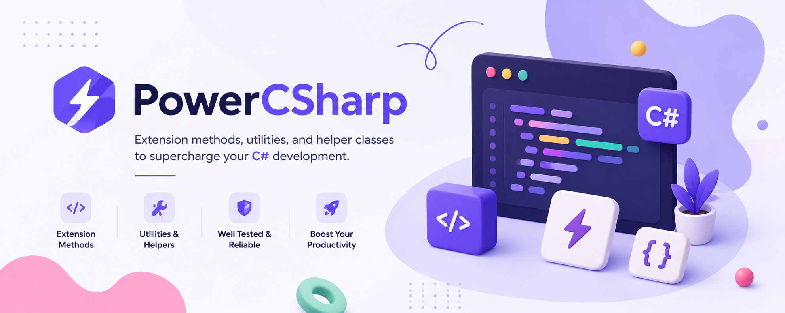

# PowerCSharp.Extensions.AspNetCore



[](https://github.com/marioarce/PowerCSharp)
[](https://opensource.org/licenses/MIT)
[](https://www.nuget.org/packages/PowerCSharp.Extensions.AspNetCore)
[](https://www.nuget.org/packages/PowerCSharp.Extensions.AspNetCore)

ASP.NET Core specific extension methods for modern web development. This package provides specialized extensions for configuration management, web utilities, and HTTP operations that require ASP.NET Core dependencies.

## 📦 Package Information

- **Package ID:** `PowerCSharp.Extensions.AspNetCore`
- **Version:** 0.3.0
- **Target Frameworks:** .NET 8.0
- **Dependencies:** 
  - `PowerCSharp.Core` (for shared interfaces)
  - `Microsoft.AspNetCore.WebUtilities` v8.0.8 (for URL query string manipulation)
  - `Microsoft.Extensions.Configuration.Abstractions` v8.0.0 (for configuration support)
  - `Microsoft.Extensions.Configuration.Binder` v8.0.0 (for configuration binding)
  - `Microsoft.Extensions.DependencyInjection` v8.0.0 (for dependency injection)
  - `Microsoft.Extensions.Options` v8.0.0 (for options pattern)

## 🚀 Installation

```bash
dotnet add package PowerCSharp.Extensions.AspNetCore
```

## 📚 Extension Categories

### ⚙️ Configuration Extensions

Simplified configuration binding and options management for ASP.NET Core applications.

```csharp
using PowerCSharp.Extensions.AspNetCore;
using Microsoft.Extensions.Configuration;

var configuration = new ConfigurationBuilder().Build();
var options = configuration.GetOptions<MyAppOptions>("MyApp"); // Reads from "MyApp" section
```

**Features:**
- **Type-safe configuration binding** with automatic validation
- **Section-based configuration** loading
- **Null-safe operations** with meaningful error messages
- **IAppOptions interface** integration for standardized options

### 🌐 HTTP & Network Extensions

Enhanced HTTP operations for web applications including request cloning and URL manipulation.

```csharp
using PowerCSharp.Extensions.AspNetCore;
using System.Net.Http;

// HTTP Status Code utilities
HttpStatusCode status = HttpStatusCode.OK;
bool success = status.IsSuccessful();         // true
bool clientError = status.IsClientError();    // false
bool serverError = status.IsServerError();     // false
bool isRedirect = status.IsRedirect();        // false

// URI manipulation with query string support
Uri uri = new Uri("https://example.com");
Uri withParam = uri.AddParameter("search", "test"); // https://example.com?search=test
Uri multipleParams = uri.AddParameter("page", "1").AddParameter("size", "10");

// HTTP Request cloning for retry scenarios
using var request = new HttpRequestMessage(HttpMethod.Get, "https://api.example.com");
var clonedRequest = request.Clone();
var clonedAsync = await request.CloneAsync();
```

**Features:**
- **Request cloning** for retry patterns and logging
- **Query string manipulation** with proper encoding
- **HTTP status code** categorization utilities
- **Async/await support** for all operations

## 🎯 Key Features

### ✅ ASP.NET Core Integration
Built specifically for ASP.NET Core applications with proper dependency injection support and middleware compatibility.

### ✅ Thread Safety
All extension methods are designed to be thread-safe when used with immutable data structures.

### ✅ Null Safety
Comprehensive null checking and graceful error handling throughout.

### ✅ Performance Optimized
Methods are optimized for performance with minimal allocations and efficient algorithms.

### ✅ Modern .NET Only
Leverages the latest .NET 8.0 features and ASP.NET Core capabilities.

## 🔗 Dependencies

PowerCSharp.Extensions.AspNetCore depends on:

- **PowerCSharp.Core** - Shared interfaces and base functionality
- **Microsoft.AspNetCore.WebUtilities** v8.0.8 - URL query string manipulation and web utilities
- **Microsoft.Extensions.Configuration.Abstractions** v8.0.0 - Configuration support
- **Microsoft.Extensions.Configuration.Binder** v8.0.0 - Configuration binding
- **Microsoft.Extensions.DependencyInjection** v8.0.0 - Dependency injection support
- **Microsoft.Extensions.Options** v8.0.0 - Options pattern support

### 🔧 Recent Updates (v0.3.0)
- **Package Compatibility**: Resolved NuGet package compatibility issues for .NET 8.0
- **Dependency Updates**: Updated all Microsoft.Extensions packages to v8.0.x for full .NET 8.0 compatibility
- **Build Improvements**: Enhanced package generation and symbol packages

## 🧪 Testing

PowerCSharp.Extensions.AspNetCore includes comprehensive unit tests. Run tests with:

```bash
dotnet test src/PowerCSharp.Extensions.AspNetCore.Tests
```

## 📖 Documentation

- [Main PowerCSharp Documentation](../../README.md) - Complete ecosystem overview
- [PowerCSharp.Core](../PowerCSharp.Core/README.md) - Core interfaces and architecture
- [PowerCSharp.Extensions](../PowerCSharp.Extensions/README.md) - Cross-platform extensions
- [Detailed API Documentation](../../docs/PowerCSharp.Extensions.AspNetCore.md) - Complete API reference
- [Contributing Guide](../../CONTRIBUTING.md) - How to contribute
- [Workflow Documentation](../../docs/WORKFLOW.md) - Development workflow

## 💡 Usage Examples

### ASP.NET Core Web API Scenario
```csharp
using PowerCSharp.Extensions.AspNetCore;
using Microsoft.AspNetCore.Mvc;

[ApiController]
public class UsersController : ControllerBase
{
    private readonly IConfiguration _configuration;

    public UsersController(IConfiguration configuration)
    {
        _configuration = configuration;
    }

    [HttpGet]
    public IActionResult GetUsers([FromQuery] string search = "", [FromQuery] int page = 1)
    {
        // Load configuration
        var apiSettings = _configuration.GetOptions<ApiSettings>("ApiSettings");
        
        // Build URL with parameters
        var baseUrl = new Uri(apiSettings.BaseUrl);
        var requestUrl = baseUrl
            .AddParameter("search", search)
            .AddParameter("page", page.ToString())
            .AddParameter("size", apiSettings.DefaultPageSize.ToString());
        
        return Ok(new { RequestUrl = requestUrl.ToString() });
    }
}
```

### HTTP Client with Retry Logic
```csharp
using PowerCSharp.Extensions.AspNetCore;
using System.Net.Http;

public class ResilientHttpClient
{
    private readonly HttpClient _httpClient;

    public ResilientHttpClient(HttpClient httpClient)
    {
        _httpClient = httpClient;
    }

    public async Task<HttpResponseMessage> ExecuteWithRetryAsync(HttpRequestMessage request, int maxRetries = 3)
    {
        HttpResponseMessage? response = null;
        
        for (int attempt = 1; attempt <= maxRetries; attempt++)
        {
            try
            {
                // Clone request for each attempt (HttpRequestMessage can only be sent once)
                var clonedRequest = request.Clone();
                response = await _httpClient.SendAsync(clonedRequest);
                
                if (response.IsSuccessStatusCode || !ShouldRetry(response.StatusCode))
                {
                    return response;
                }
                
                await Task.Delay(TimeSpan.FromSeconds(Math.Pow(2, attempt)));
            }
            catch
            {
                if (attempt == maxRetries) throw;
            }
        }

        return response ?? throw new InvalidOperationException("Failed to execute request after retries");
    }

    private static bool ShouldRetry(HttpStatusCode statusCode)
    {
        return statusCode.IsServerError() || statusCode == HttpStatusCode.RequestTimeout;
    }
}
```

### Configuration Management
```csharp
using PowerCSharp.Extensions.AspNetCore;

public class AppSettings
{
    public string ApiUrl { get; set; } = "";
    public int MaxRetries { get; set; } = 3;
    public bool EnableLogging { get; set; } = true;
}

public class Startup
{
    public void ConfigureServices(IServiceCollection services, IConfiguration configuration)
    {
        // Load and validate settings
        var settings = configuration.GetOptions<AppSettings>("AppSettings");
        
        // Configure services based on settings
        services.Configure<AppSettings>(configuration.GetSection("AppSettings"));
        
        if (settings.EnableLogging)
        {
            services.AddLogging();
        }
    }
}
```

## 🏗️ Architecture

PowerCSharp.Extensions.AspNetCore follows the same architectural principles as the PowerCSharp ecosystem:

- **Centralized interfaces** from PowerCSharp.Core
- **Consistent namespace organization** with `PowerCSharp.Extensions.AspNetCore.*`
- **Clear separation of concerns** between web-specific and cross-platform functionality
- **Dependency injection friendly** design

## 🤝 Contributing

Contributions are welcome! Please read our [Contributing Guidelines](../../CONTRIBUTING.md) for details.

### Development Setup

1. Clone the repository
2. Navigate to PowerCSharp.Extensions.AspNetCore project
3. Restore dependencies: `dotnet restore`
4. Run tests: `dotnet test`
5. Make your changes
6. Add tests for new functionality
7. Submit a Pull Request

### Adding New Extensions

When adding new ASP.NET Core specific extension methods:

1. **Choose the right category** - Place extensions in the appropriate folder (Configuration, Net, etc.)
2. **Follow naming conventions** - Use descriptive, PascalCase method names
3. **Add XML documentation** - Include comprehensive XML docs
4. **Write unit tests** - Cover all scenarios and edge cases
5. **Update documentation** - Add to API documentation
6. **Consider cross-platform compatibility** - If functionality could work outside ASP.NET Core, consider adding to PowerCSharp.Extensions instead

## 📄 License

This project is licensed under the MIT License - see the [LICENSE](../../LICENSE) file for details.

## 🔗 Related Packages

- [PowerCSharp.Core](../PowerCSharp.Core/README.md) - Core interfaces and architecture
- [PowerCSharp.Extensions](../PowerCSharp.Extensions/README.md) - Cross-platform extension methods
- [PowerCSharp.Utilities](../PowerCSharp.Utilities/README.md) - Utility classes and helpers
- [PowerCSharp.Helpers](../PowerCSharp.Helpers/README.md) - Specialized helper classes

## 📞 Support

- 🐛 [Report Issues](https://github.com/marioarce/PowerCSharp/issues)
- 💡 [Feature Requests](https://github.com/marioarce/PowerCSharp/discussions)
- 📧 [Email Support](mailto:support@example.com)

---

**PowerCSharp.Extensions.AspNetCore** - Making ASP.NET Core development more powerful, one extension at a time! 🚀

[← Back to Main Documentation](../../README.md)
